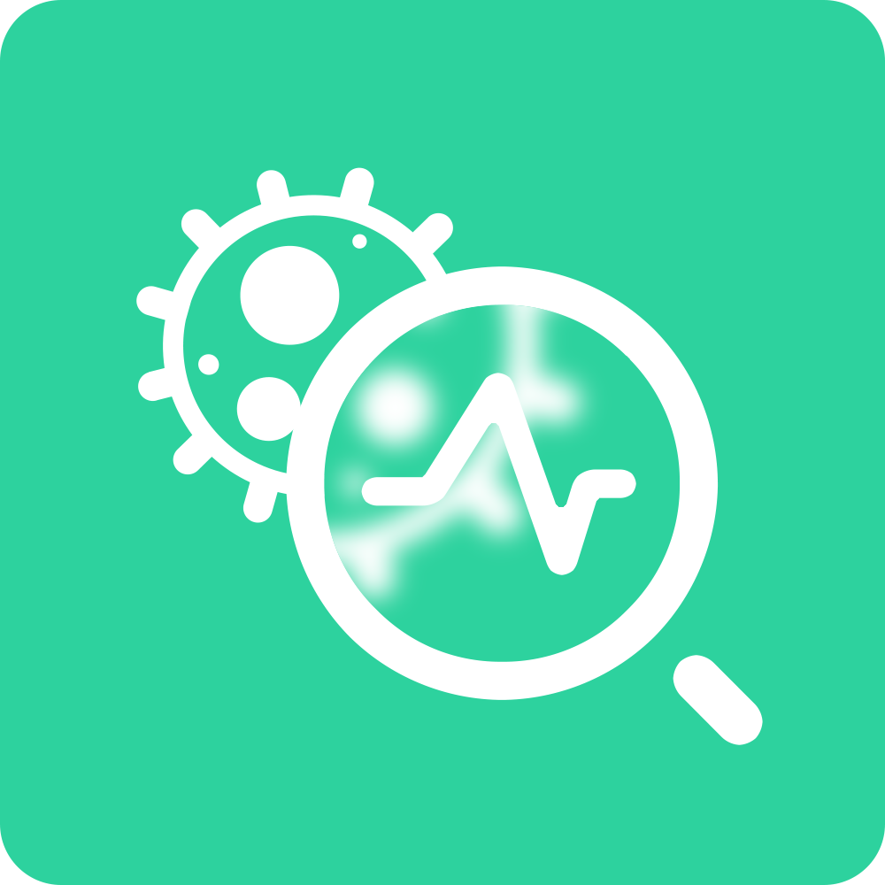

# COVID-19 Self-Diagnoser

For HackNYU 2020, our team made a coronavirus diagnoser in response to the growing pandemic. A webapp like this doesn't exist yet for the general U.S. populace, so we thought it'd be an important tool to have.

This webapp was built with the React.JS library in the frontend and the Flask web framework for the backend. We also connected our code to a geofencing API provided by [Radar.io](https://radar.io/documentation/geofences) to tell our clients when they are about to enter an infected area.

## The Frontend

In the project directory, you can run:

### `yarn start`

Runs the frontend in development mode (but make sure you've run `yarn add` to install packages first). 
Open [http://localhost:3000](http://localhost:3000) to view it in the browser.

The page will reload if you make edits. 
You will also see any lint errors in the console.

## The Backend

In the `backend/` directory, follow these steps:
1. Make the virtual environment with `python3 -m venv venv`
2. Activate the environment with `. venv/bin/activate`
3. Install all dependencies with `pip install -r requirements.txt`
4. Export Flask environment variables with `export FLASK_APP=server.py` and `export FLASK_ENV=development`
5. Start the server with `flask run`

**Commands may vary if you are on a Windows OS, reference [this](https://flask.palletsprojects.com/en/1.1.x/installation/#installation). Also, don't forget to `deactivate` when you are done.

